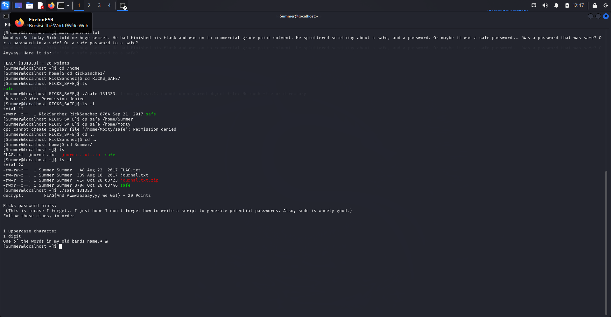

# TP 1

# Premiere étape

Importation des VM : OK

Mise en place d’un réseeau NAT : OK

Ping depuis KALI vers la machine cible : OK

# Deuxième etape

1- Lancement de la commande netdiscover pour scanner et lister les appareils connectés à un résreau LAN : sudo netdisocver -r 198.164.12.0/24

2- Lancement de la commande nmap sur la plage de réseau : 
⇒ nmap nous permets de voir les services actifs sur cette machine et les ports ouverts 

sudo nmap 198.164.12.4

on voit clairement une activié ssh sur le port 22, et un service “zeus-admin” sur le 9090

Pour optimiser la commande nmap, on va lui dire de scanner tous les port, et les services et leurs versions ainsi que les scripts vulnirable 

sudo nmap -sV -p- vv --script=vulners 198.164.12.4

On obtient plus d’informations sur les services et les ports ainsi que les vulnirabilités 

Aussi, lancer un sudo nmap -A 198.164.12.4  pour faire un scan agressif et avoir exactement les exploits qu’il y a sur le ftp port 21 

On va copier sur le navigateur pour voir ce qu’il existe sur cette vulnirabilité 

Après avoir fait une recherche sur connection ftp anonymous, le login mot de passe est : 
login : anonymous

mot de passe : 
`anonymous@domain.com`

Et on a découvert le 2eme Flag : 

Aussi, on va faire netCat(nc) pour établir une connexion avec les ports “uknown”

Port 13337 ⇒ 

FLAG:{TheyFoundMyBackDoorMorty}-10Points

Port 60000 ⇒ 

FLAG{Flip the pickle Morty!} - 10 Points

3- On passe sur le port 22, on va faire du brute force avec hydra

On va utilisé une wordlist de kali : 

voici la commande : 

hydra -L /usr/share/sqlmap/data/txt/wordlist.txt -P /usr/share/sqlmap/data/txt/wordlist.txt ssh://198.164.12.4 -t 4 -V

Comme on s’y attendait, la commande ne marche pas, elle n’a pas réussi à accéder au service SSH .12.4

4- On va passé sur le port 80 - service Apache (Web)

On va commencer par analyser les spécificités du port 80 avec la commande nmap -A -vv -p 80 198.164.12.4, on a le titre du site, les méthodes http etc…

Ensuite, on va faire un robots.txt 

On va accéder au robotShell

On va utiliser la commande more /etc/passwd pour lister les informations des utilisateurs 

Grace à nikto, on a trouver un autre flag, la commande nikto à analyse le web service pour trouver des vulnirabilités :  

voici le résultat de nikto : 

si on accéde à l’url /passwords

En inspectant la page de password.html, on trouve un indice pertinent, un mot de passe “winter” : 

On peut faire un lien avec l’utilisateur Summer pour pouvoir se connecter à undes ports SSH, le 22222 et on a bien réussi à se connecter : 

J’ai copié le contenu du dossier morty sur mon répertoire en local 

Je lance la commande string Safe_Password.jpg pour afficher les portions de texte lisible de cette image et on trouve le mot de passe pour le dossier zippé : 

Voici le contenu de journal.txt

J’inspecte le dossier RickSanchez, j’ai quand meme vérifié si il y avait un flag dans ce répertoire 

J’ai trouvé un exécutable “safe”, mais j’ai eu des difficultés à le lancer, pour résoudre le problème j’ai copier le fichier safe dans le répértoire Summer ou j’ai les droits, pour pouvoir l’exécuter avec le mot de passe trouver en paramétre dans le journal qu’on a Unzip Avant : 

En faisant une recherche sur internet de “Rick Sanchez old nands name, j’obtiens : 

L’idée  maintenant est de créer une word list autour de ces mots avec la commande crunch 

pour “the” ⇒ crunch 5 5 -t ,%the (un mot de passe de 5 caractères contenant “the”, une majuscule et un digit)

pour “Flesh” ⇒ crunch 7 7 -t  ,%Flesh (un mot de passe de 7 caractères contenant “Flesh”, une majuscule et un digit)

pour “Curtains” ⇒ crunch 10 10 -t  ,%Curtains (un mot de passe de 10 caractères contenant “Curtains”, une majuscule et un digit)

Maintenant on va faire du brute Force avec Hydra sur le port SSH 22222 avec l’utilisateur RickSanchez : 

hydra -l RickSanchez -P word-list-rsanchez.txt ssh://198.164.12.4:22222

On a un bon résultat, on a réussi à trouvé le mot de passe pour cet utilisateur : 

En me connectant en SSH, et en faisant un sudo -l, je vois que l’utilisateur a le droits d’exécuter toutes les commandes, je passe en mode root et je trouve le dernier flag : 

