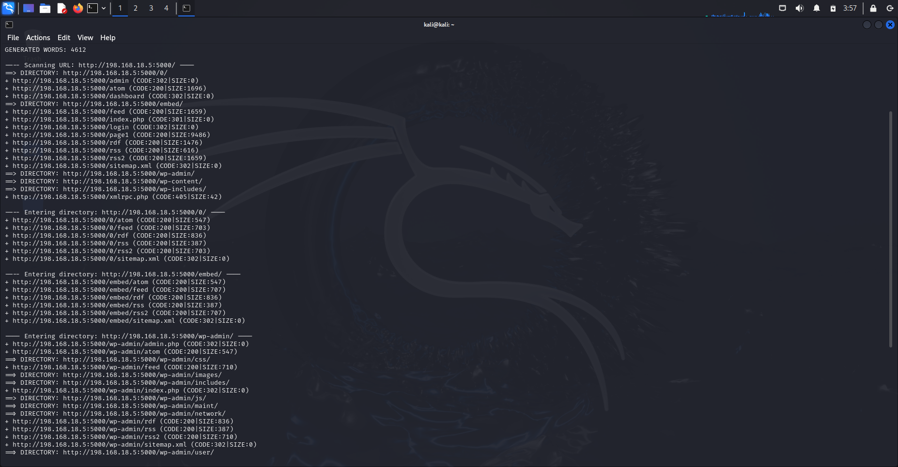
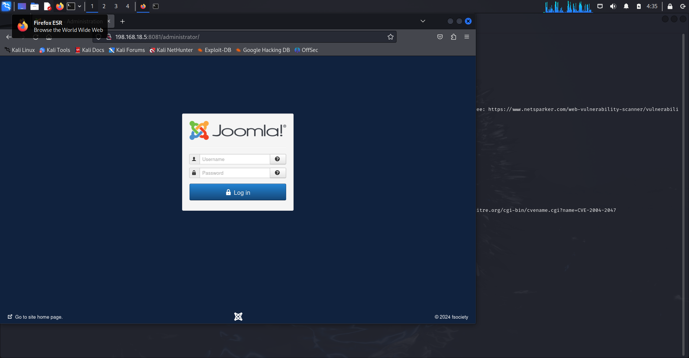

# TP2

# Premiere étape

Importation des VM : OK

Mise en place d’un réseeau NAT : OK

# Phase de Découverte

Lancement de la commande netdiscover pour scanner et lister les appareils connectés à un réseau LAN : sudo netdisocver -r 198.168.18.0/24

On va passer à la commande nmap pour cibler les 2 ip dans le bute de voir les services et ports actifs sur chaque ip et identifier clairement la machine cible

On commence par l’ip :198.168.18.3

On ne vois pas quelque chose intéressent sur cet IP

Ensuite, on va cibler l’ip : 198.168.18.5

Super, on a clairement identifié des services et port actifs sur cet IP, c’est donc l’ip de la machine cible

Dans un premier temps, je vois 4 service WEB actif sur les ports :  80; 8081,9001, 5000

Le port 5000 héberge un site web WordPress, on va commencer à investiguer ce service avec les commandes nikto, et dirb

Nikto : 

On a clairement pas d’information pertinente.

Dirb : 

Aussi, en essayant les différentes URL, je ne trouve pas d’informations pertinentes

La seul piste qu’on a actuellement, c’est qu’on sait que c’est un site Word Press, on va utiliser la commande wpscan pour scanner le site web

wpscan : 

On va que l’indice de confiance est à 100%, ce qui veut dire que aucune vulnérabilité n’a été trouvé sur ce port.

On refait l’analyse de nikto pour voir si on n’est pas passé à coté d’une information

On voit un wp-login.php qui est une page de connexion

Aussi, en testant d’accéder à une route random, on tombe sur un shell

Voici une premiere vulnérabilité, on peut injecter des commandes sur le shell, on trouve la liste des utilisateurs

On passe au port suivant, le port 8081 : 

On voit une page de login.
On passe au commande nikto et dirb

Nikto : 

On a beaucoup d’information, on peut aller sur /robots.txt

On a l’information que JOOMLA est utilisé sur ce site
Si on accède au /adminstrator, on a une page de connexion

On utilise joomscan pour analyser les vulnirabilités du site joomla : joomscan —url http/198.168.18.5:8081

On voit une vulnérabilité sur une potentiel injection SQL.

On voit clairement l’exécution d’un requête SQL qu’on peut exploiter pour faire une injection SQL.

Inection SQL :

On va maintenant lister les tables de la base joomla_db :

Il y a 67 tables.

on va investiguer la table user : hs23w_users : 

voici les columns : 

Et voici les données de la table : 

Et on voit une autre faille de sécurité !, pour l’utilisateur elliot, la colonne email semble être un mot de passe ! 

Avec ces informations, on va essayer d’accéder en ssh au port 22

Et voici ce qu’on a trouver sur cette machine : 

On passe maintenant sur le port 80 : 

sur le robots.txt on trouve 2 pages non exploitable d’un premier coup d’oeil : 

On passe maintenant au port 9001 qui expose aussi un service Web : 

On commence par la commande nikto : 

On a pu identifié le type de service qui est drupal, version 7
On va chercher plus d’exploit avec metaxploit : 

On vois une vulnérabilité sur drupal : 

L’idée est d’exploiter cette faille pour avoir un shell d’exécution sur ce service.

Etape 1 : 

on selectionne le module à exploiter

⇒use exploit/unix/webapp/drupal_drupalgeddon2  

Etape 2 :

on configure l’adresse ip et le port cible : 

Etape 3 : 

On lance l’exploit : 

on va essayer d’accèder directement au shell avec la commande shell

On a utilisé les commandes shell pour obtenir l’accès au shell de la machine distante et la commande bash -i pour créé une instance d’un bash

Dans un premier temps j’affiche l’ID de l’utilisateur actuel et les utilisateurs de /etc/passwd

Je reviens sur le dossier drupal pour investiguer les répértoires et fichiers

sur le dossier profiles on trouve cette description : “

## WHAT TO PLACE IN THIS DIRECTORY?

Place downloaded and custom installation profiles in this directory.
Installation profiles are generally provided as part of a Drupal distribution.
They only impact the installation of your site. They do not have any effect on
an already running site. 

“

sur le dossier modules : 

“

his directory is reserved for core module files. Custom or contributed modules
should be placed in their own subdirectory of the sites/all/modules directory.
For multisite installations, they can also be placed in a subdirectory under
/sites/{sitename}/modules/, where {sitename} is the name of your site (e.g.,
[www.example.com](http://www.example.com/)). This will allow you to more easily update Drupal core files.

“

Par contre sur le dossier misc, on trouve les fichier JS de l’application et un fichier .pass !! (mot de passe ?)

En ouvrant le fichier tyrell.pass : 

On a trouvé le mot de passe et le nom d’utilisateur !!!

Username: tyrell
Password: mR_R0bo7_i5_R3@!_

On va maintenant essayé de se connecter en ssh depuis notre kali : 

Je n’ai pas l’accès en sudo…

On va faire un sudo -l pour voir les droits de notre utilisateur ! 

On cherche sur internet ce droit pour voir si on peut l’exploiter. Je cherche journalctl vulnerability et je trouve cette page : 

on va donc ajouter le !/bin/sh dans le fichier /bin/journalctl

je fait sudo journalctl et jécris !/bin/sh et je suis en root !!

j’accède au dossier root et j’affiche le texte : 

