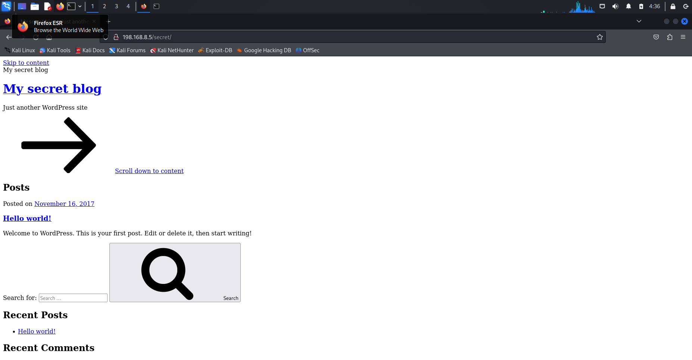
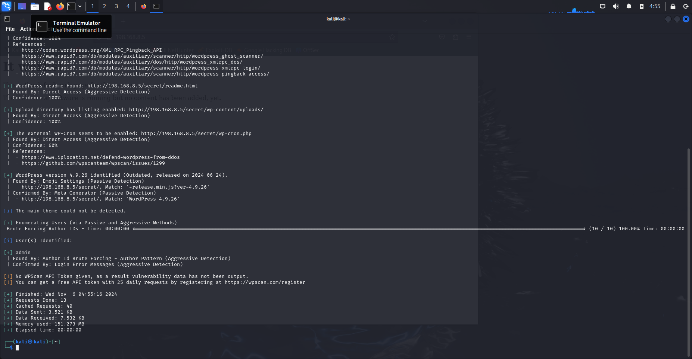

# TP3

Comme pour les autres TP, je commence d’abord par mettre en place un réseau NAT.

mportation des VM : OK

Mise en place d’un réseeau NAT : OK

# Phase de Découverte

Lancement de la commande netdiscover pour scanner et lister les appareils connectés à un réseau LAN : sudo netdisocver -r 198.168.8.0/24

Comme pour le TP2, on va passer à la commande nmap pour cibler les 2 ip dans le bute de voir les services et ports actifs sur chaque ip et identifier clairement la machine cible

On commence par l’ip :198.168.8.3

sudo nmap -sV -p- -vv --script=vulners 198.168.8.3 : 

On ne vois pas quelque chose intéressent sur cet IP

Ensuite, on va cibler l’ip : 198.168.8.5

On voit qu’il y a plusieurs services, ftp ssh et http,

On va booster notre commande nmap pour analyser port par port, je commence par cibler le port ftp qui est le : 21

On voit l’utilisation de proFTPD version 1.3.3c, qui est un serveur FTP libre.
On va maintenant chercher des exploit sur cette version !

On voit clairement qu’il y a une faille backdoor sur cette version.

On va utiliser metasploit pour exploiter cette faille et atteindre le root via la backdoor

Voici le résultat de la commande, search proFTPD 1.3.3c : 

On va suivre exactement les étapes qu’on a fait au TP2, utiliser l’exploit, configurer l’adresse ip et port cible et lancer l’exploit.

Etape 1 : 

utiliser l’exploit : 

use xploit/unix/ftp/proftpd_133c_backdoor

Etape 2 : 

Configurer l’adresse et port cible : 

set RHOST 198.168.8.5

set RPORT 21

Etape 3 : 

lancer l’exploit ! 

- ] 198.168.8.5:21 - Exploit failed: A payload has not been selected.
[*] Exploit completed, but no session was created.

On arrive pas à exploiter car on n’a pas configurer un contexte de payload, 

Un payload est la charge que va utiliser metasploit pour lancer l’attaque : 

On va utiliser le reverse Shell : O

On relance l’exploit ! 

Incroyable, grace à cette faille, on rentre déjà en route sur la machine !! 
On va explorer un peu, j’ai juste récupérer la liste des utilisateurs 

## Port 80

On va maintenant passer sur le port 80, http qui expose un service Web.
On reprend depuis le début avec la commande nmap et voir ce qu’on peut exploiter

On identifie clairement un serveur apache : 

On va accéder à l’URL du site : 

Je vais passer aux commandes liés au services Web : 

Nmap cibler sur le service Web pour avoir les enums (routes) les informations sur headers et voir si il y a un CMS  :

 

sudo nmap -sV -p 80 --script=http-enum,http-title,http-headers,http-methods 198.168.8.5

Résultat intéressent, on va voir la ressources /secret

Les liens nous envoi vers des pages not found avec comme nom de domaine le nom de la machine.

Sois en modifie à chaque dans l’url vtsec par l’ip, ou on configure ce host en la bindant sur cette IP :  on modifie le fichier /etc/hosts

Le site a chargé toutes ces ressources : 

On trouve une page de login ! : 

On conclu qu’il y a bien CMS qui est WordPress…(encore lui)

Qui dit WordPress, dit wpscan, on va lancer cete commande pour scanner le site ! 

J’ai un peu chercher sur cette commande et je vais la lancer ainsi pour énumerer tous (utilisateurs,thémes, plugins) : 

wpscan --url http://198.168.8.5:80/secret/ --enumerate u,p,t

Mais on va lancer paramètres par paramètres pour une meilleurs lisibilité : 

pour les utilisateurs : 

En identifié un utilisateur “admin”

pour les thèmes : 

Pour les plugins (aucun trouvé) : 

Aussi, sur les trois commandes on a identifié la version de wordPress : 4.9.26

et l’utilisation de cette ressources externes qui est pas sur à 100% : 

The external WP-Cron seems to be enabled: [http://198.168.8.5/secret/wp-cron.php](http://198.168.8.5/secret/wp-cron.php)
| Found By: Direct Access (Aggressive Detection)
| Confidence: 60%
| References:
|  - [https://www.iplocation.net/defend-wordpress-from-ddos](https://www.iplocation.net/defend-wordpress-from-ddos)
|  - [https://github.com/wpscanteam/wpscan/issues/1299](https://github.com/wpscanteam/wpscan/issues/1299)

On va faire la commande Nikto : 

Elle nous apporte pas plus d’informations, 

On va passer sur la commande Dirb qui va faire du brute force pour trouver les répértoires et fichiers cachés : 

On a trouver la ressources /wp-admin/ qui nous renvoi vers la page de login : 

Je vais essayer de faire “admin”, “admin” 

Mot de passe admin et utilisateur admin : 

ça marche… (j’aurais du essayer dès le début…)

La je suis sur l’interface administrateur de wordPress

Voilà j’ai pu modifier le site

Enfin, je repasse en root via le ftp, et je modifie le mot de passe de marlinspike pour me connecter depuis cet utilisateur : 

On se connecter en ssh !!! 

