# TP4

Comme pour les autres TP, je commence d’abord par mettre en place un réseau NAT.

mportation des VM : OK

Mise en place d’un réseeau NAT : OK

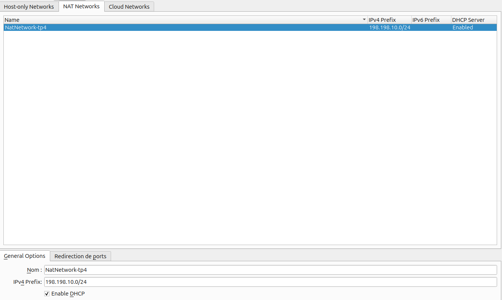

# Phase de Découverte

Lancement de la commande netdiscover pour scanner et lister les appareils connectés à un réseau LAN : sudo netdisocver -r 198.168.10.0/24

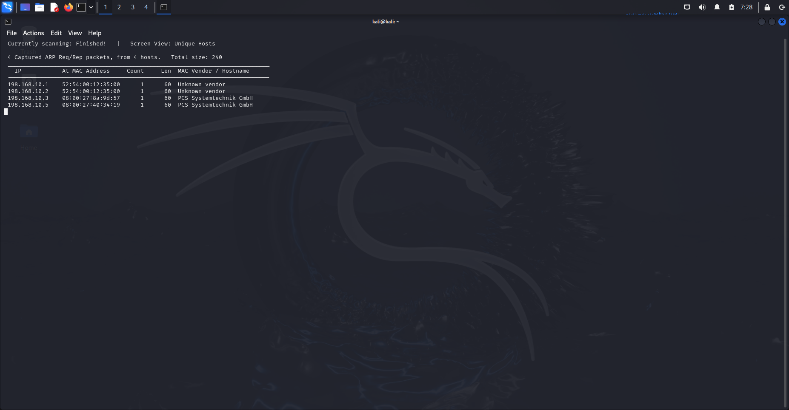

Comme pour le TP2, on va passer à la commande nmap pour cibler les 2 ip dans le bute de voir les services et ports actifs sur chaque ip et identifier clairement la machine cible

On commence par l’ip :198.168.8.3

sudo nmap -sV -p- -vv --script=vulners 198.168.10.3 : 

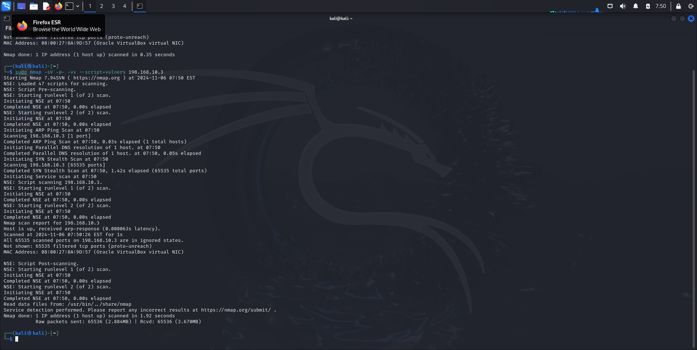

On ne vois pas quelque chose intéressent sur cet IP

Ensuite, on va cibler l’ip : 198.168.10.5

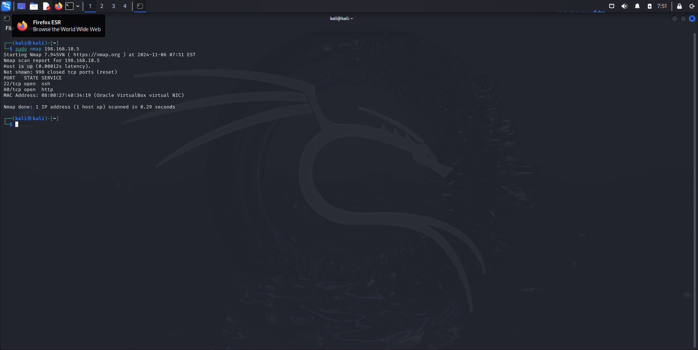

J’identifie 2 service, ssh et http, je refait un nmap plus poussé : 

sudo nmap -sV -p- -vv --script=vulners 198.168.10.5

On a eu pas mal d’informations sur de possible vulnérabilités sur le port 80 (apache)

Je vais accéder au site 198.168.10.5:80

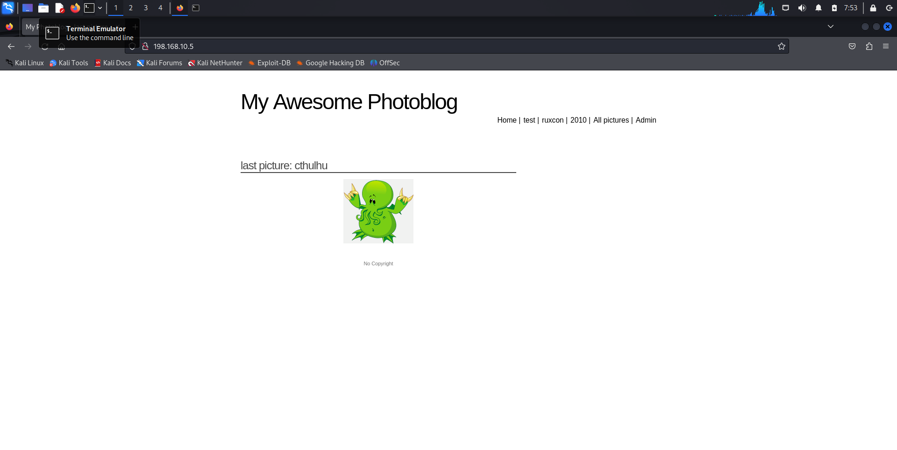

On va commencer par faire la commande nikto pour scanner ce service Web : 

nikto -h 198.168.10.5:80

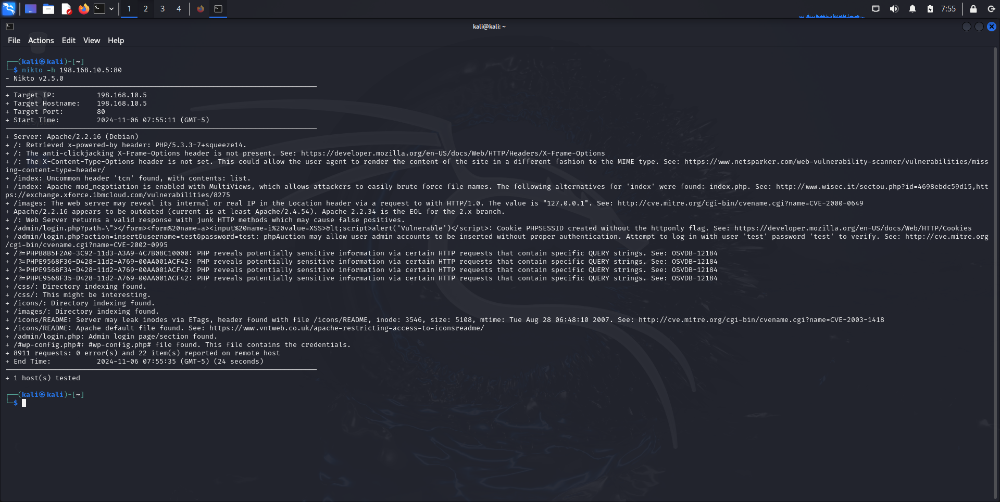

On a pas mal de ressources, notamment une page de connexion /admin/login.php

On va maintenant essayer de naviguer sur les tags de la page d’accueil du site.

on vois des requêtes get partir avec un id comme “queryParam” sur un fichier nommé cat.php

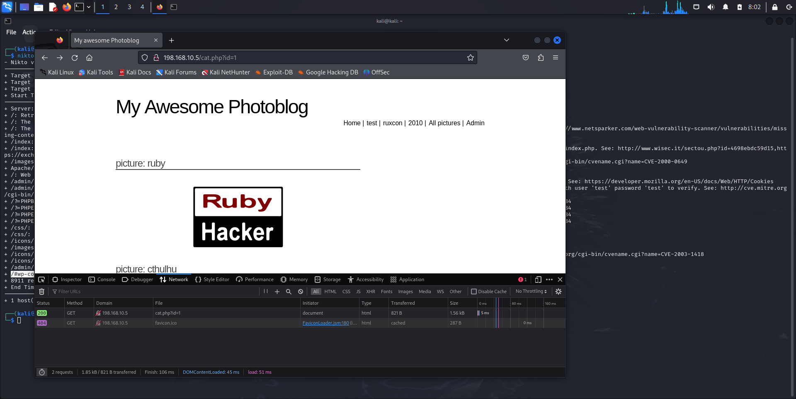

L’idée est d’essayer d’injecter du SQL via l’url : 

l’url est : [http://198.168.10.5/cat.php?id=1](http://198.168.10.5/cat.php?id=1)

Tenter de chercher sur une autre éventuelle colone : 

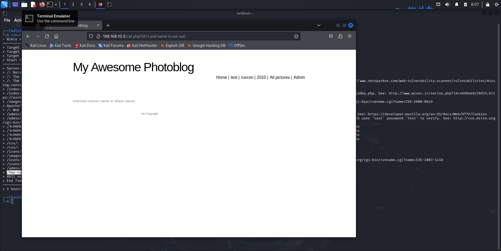

On va bien dans le retour qu’on peut accéder à la requête SQL (qui est un select)

On va essayer de provoquer une erreur de syntaxe, on rajoutant par exemple un caractère : 

 

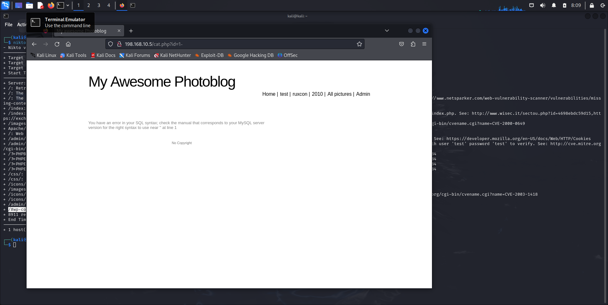

Comme ça on a clairement identifier le SGBD qui est : MySQL

Maintenant on va passer à l’étape de récolte d’information avec sqlmap 

## SQLMAP

On va commencer par essayer de récupérer les instances de base de données existante avec la commande qui va exploiter la faille: 

sqlmap -u [http://198.168.10.5/cat.php?id=1](http://198.168.10.5/cat.php?id=1)  —dbs

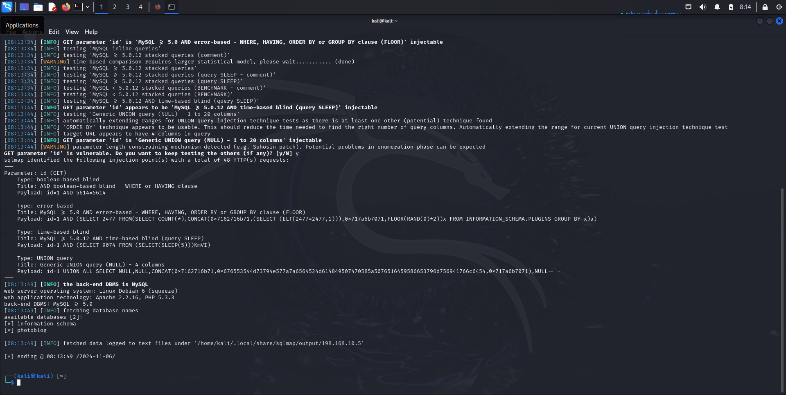

On identifie 2 base de données, on va les explorer, on va surtout explorer la base de données  “photoblog” ⇒ lien avec le titre du site

On va lister les tables de cette base : 

sqlmap -u [http://198.168.10.5/cat.php?id=1](http://198.168.10.5/cat.php?id=1)  -D photoblog —tables

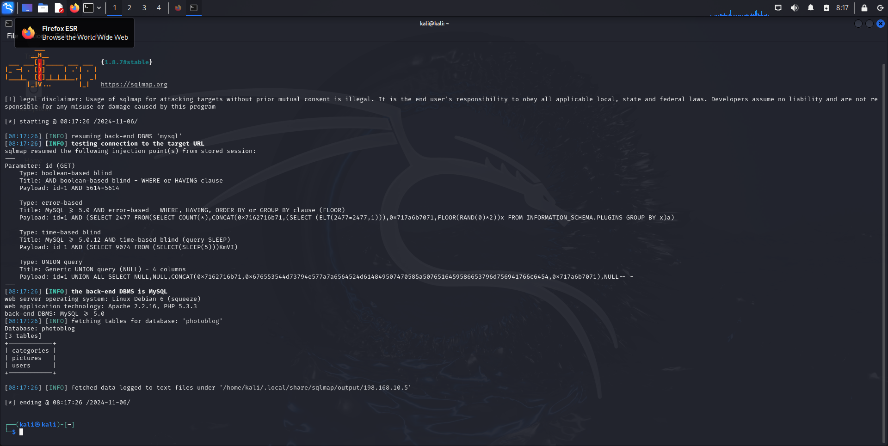

On identifie 3 tables (categories, pictures, users)

On va se concentrer sur users

sqlmap -u [http://198.168.10.5/cat.php?id=1](http://198.168.10.5/cat.php?id=1) -D photoblog -T users --columns

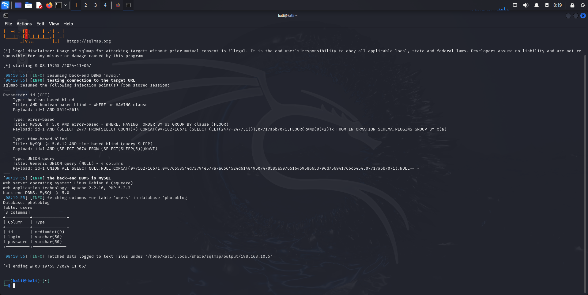

On a le champ id, login et password

Et maintenant on veut les données de cette table : 

sqlmap -u [http://198.168.10.5/cat.php?id=1](http://198.168.10.5/cat.php?id=1) -D photoblog -T users --dump

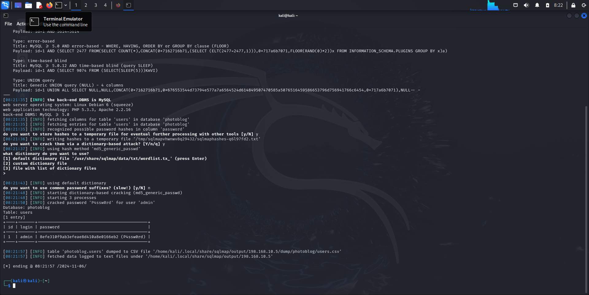

On a trouver l’utilisateur admin, grace à un dictionnaire par défaut de sqlmap, on a peu déchiffrer et trouver le mot de passe qui est : P4ssw0rd

On va se connecter via la page de login pour voir si on a bien réussi : 

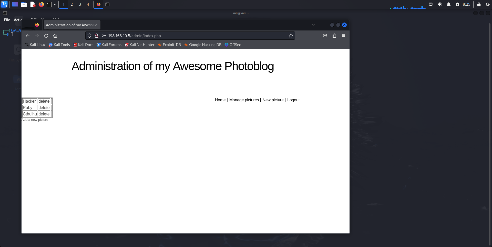

On tombe sur une interface qui nous donne la possibilité d’envoyer des photos (pictures), potentiellement on peut injecter des script pour avoir un shell

On va utiliser un script mis à disposition par kali linux, dans le répértoire : 

/usr/share/webshells/php

On va utiliser un reverse shell, le fichier : php-reverse-shell.php

Pour y arriver, on va modifier le fichier pour mettre notre adresse IP, et un port d’ecouter, sur lequel on va écouter avec netcat : 

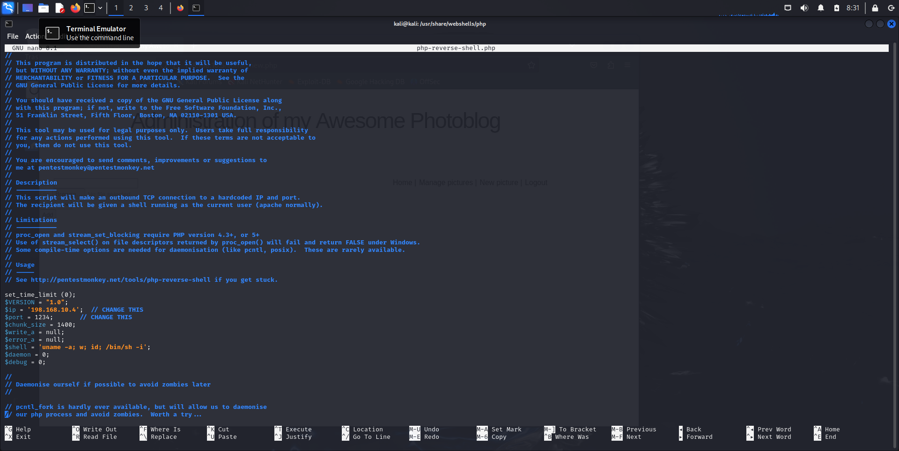

Je vais maintenant essayer de upload ce fichier dans le site web

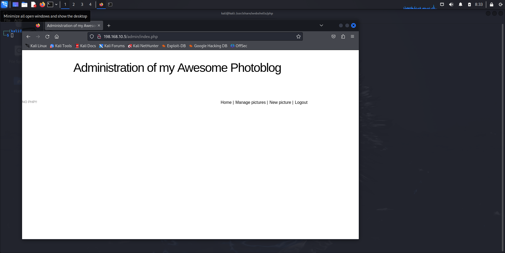

bon il y a un filtre sur les extention, je vais modifier l’extention et essayer de re-upload le fichier

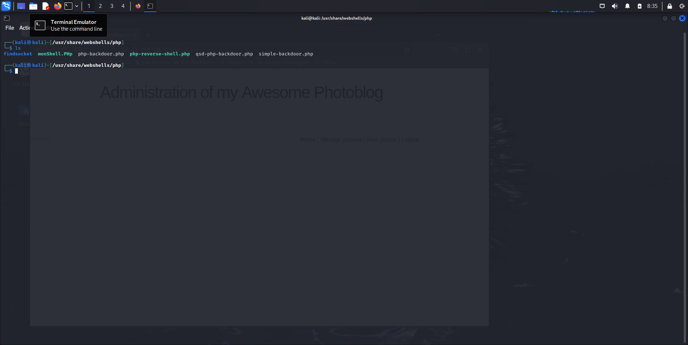

J’ai fait une copie nommé monShell depuis le fichier de base, je re-upload : 

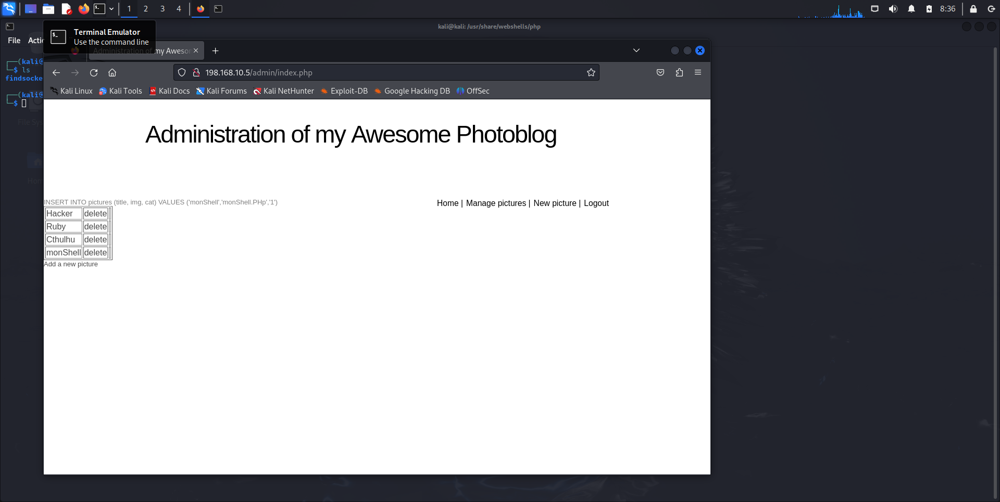

J’ai bien réussi à envoyer le fichier php pour avoir un reverse shell, maintenant on va lancer l’écoute sur notre host avec netcat : 

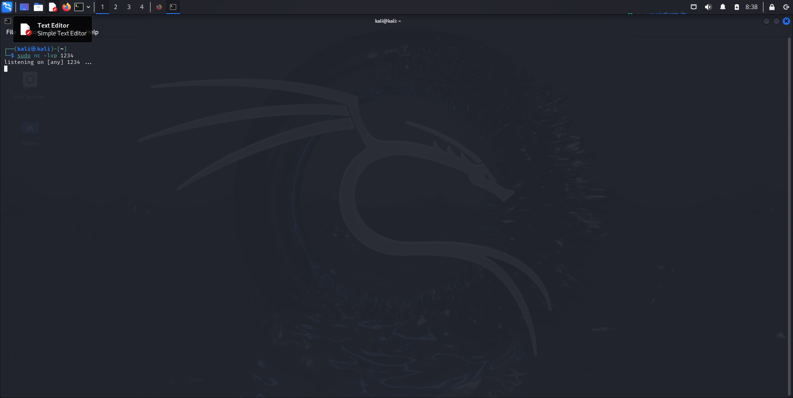

Je vais ouvrir le fichier sur le site Web pour voir si l’écoute est OK : 

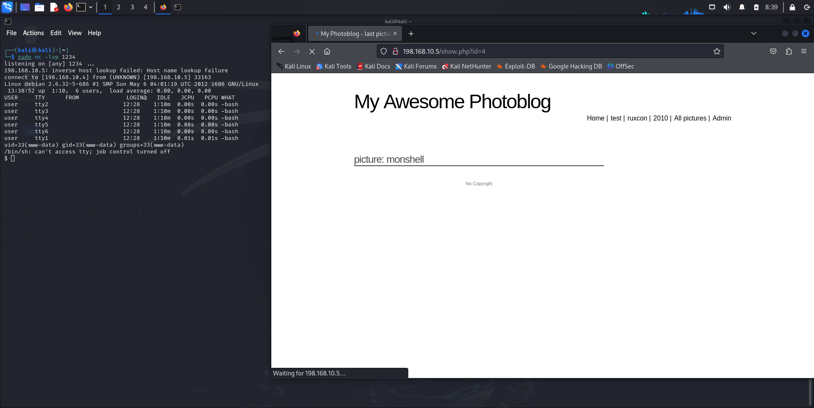

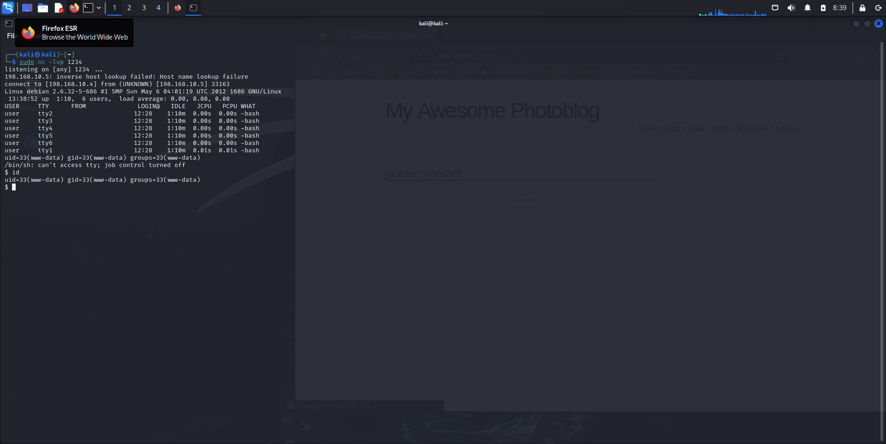

On a réussi, on a un shell sur la machine pour lancer les commandes qu’on veut.