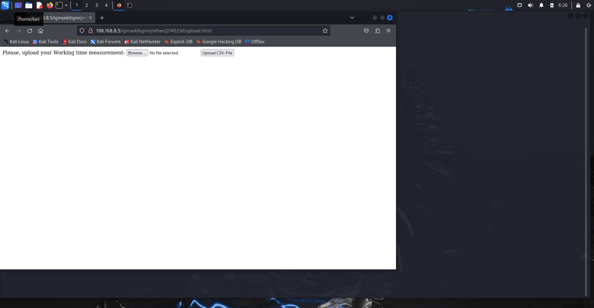

# TP5

Comme pour les autres TP, je commence d’abord par mettre en place un réseau NAT.

mportation des VM : OK

Mise en place d’un réseeau NAT : OK

# Phase de Découverte

Lancement de la commande netdiscover pour scanner et lister les appareils connectés à un réseau LAN : sudo netdiscover -r 198.168.8.0/24

Comme pour le TP2, on va passer à la commande nmap pour cibler les 2 ip dans le bute de voir les services et ports actifs sur chaque ip et identifier clairement la machine cible

On commence par l’ip :198.168.8.3

sudo nmap 198.168.8.3 : 

On ne vois pas quelque chose intéressent sur cet IP

Ensuite, on va cibler l’ip : 198.168.8.5

On voit qu’il y a plusieurs services, ssh, http, pop3 et imap

On va booster notre commande nmap pour analyser port par port, je commence par cibler le port http qui est le : 80 : 

sudo nmap -sV -p 80 -A -vv --script=vulners 198.168.8.5 : 

On identifie immédiatement que c’est un serveur Apache (2.4.18)

Je vais accéder au site via un navigateur : 

Pour continuer l’analyse, on va passer à la commande nikto pour scanner ce service Web : 

nikto -h 198.168.8.5:80 : 

Aucune piste trouver avec cette commande.

Je vais essayé d’accéder au robots.txt

Je vérifie d’abord la ressource /robots.txt, cette dernière me renvoi une page 404, mais en testant en majuscule (astuces donner dans les hints de vulnhub :Hints: Nikto scans "case sensitive” ), la ressource /ROBOTS.TXT me renvoi un information : 

“disallow : /upload” me fait pensé à d’éventuel restriction pour accéder à la ressource upload

Je vois aussi tout en bas de la page cette ressources : 

Cette dernière me renvoi une erreur 403 (accès non autorisé) : 

Pour aller plus loin je vais faire la commande dirb pour scanner les fichiers et ressources cachés du service Web : 

Dirb a trouvé 2 ressources : /index.html et /server-status

index.html : 

Qui est la page par default de apache2

et server-status : 

Une page au statut 403 a été envoyé (je n’ai pas les permissions d’accéder à cette ressources)

La commande dirb n’a envoyé aucune information en rapport avec la ressources /upload.

Je vais relancer la commande dirb en spécifiant exactement la ressources cible (/upload)

Je vais la meme chose avec l’autre ressource : 

Cette fois on a quelque chose d’interessent, je vais accèder à la ressource : 

[http://198.168.8.5:80/igmseklhgmrjmtherij2145236/upload/](http://198.168.8.5/igmseklhgmrjmtherij2145236/upload/)

Malheureusement j’ai un retour 403….

Meme en relancant un brute force dirb sur cette URL ; [http://198.168.8.5:80/igmseklhgmrjmtherij2145236/upload/](http://198.168.8.5/igmseklhgmrjmtherij2145236/upload/)
Je n’ai pas quelque chose de pertinent 

Je me place sur le répértoire de dirb, pour essayer de lancer la commande avec d’autres wordList,
J’ai essayé avec plusieurs wordList presente, et c’est avec la wordList nommé : “extensions_common.txt” que j’ai pu trouvé quelques chose intéressent ! 

Cette information n’est pas exploitable mais me donne une idée.

Je vais relancer la commande avec la wordList commons, en lui distant de rajouté l’extention .php et .html sur la ressource ; 

[http://198.168.8.5:80/igmseklhgmrjmtherij2145236/](http://198.168.8.5/igmseklhgmrjmtherij2145236/)

Il y a bien des fichier upload.html et upload.php au niveau du site web
Le fichier html : 

Le fichier .php

(Je conclu que pour l’utilisation de dirb, c’est bien de lancer une premiere fois sans extensions, puis rejouer le dirb avec des extension qui sont assez connu,(html, php, js)…)

Maintenant, je vois qu’on peut upload des fichiers, on va faire comme le TP4, se mettre en ecoute sur le port 1234 et faire un netCat pour attendre la notification de notre reverse shell php, fourni par kali linux.

Je vais me mettre en écoute avec netcat et accèder au fichier via l’URL : 

Voici ce que j’ai trouvé dans le répertoire thomas : 

“ajouter un point ! sur les mots de passe”, je suppose qu’il faut une wordList…

Je vais aller dans le reprtoire wordlists, faire la modifications sur des wordlist utiliser pour les mots de passe et faire du brute force avec hydra 

J’ai trouvé après quelques recherche sur internet que le dossier rockyou possède des worldlist concernant les mots de passe, je vais exploiter ce dossier 

Je vais rajouter un “!” à chaque mot de passe avec la commande :

sed -i 's/$/!/' rockyou.txt

Maintenant je vais faire du brute force à avec hydra sur le port ssh 22 avec l’utilisateur thomas.

La commande prends un peut de temps car le fichier est chargé, j’ai lancé sur 4 threads, je laisse tourner la commande, je vais exploiter une autre piste.

(J’ai stoppé la commande car ça prend beaucoup de temps)

Je vais explorer la piste de version de machine pour voir si il y a un exploit à explorer : 

$ cat /etc/issue
Ubuntu 16.04 LTS \n \l

$ uname -a
Linux funbox4 4.4.0-21-generic #37-Ubuntu SMP Mon Apr 18 18:33:37 UTC 2016 x86_64 x86_64 x86_64 GNU/Linux

On va utiliser metasploit pour chercher une faille : 

En cherchant sur internet, je vois que ces exploit sont des fichier .c à éxecuter, j’ai télécharger le fichier lié exactement à la version de la machine cible : 

Maintenant, l’idée est de compiler ce fichier, et l’upload via le site, puis accèder à notre reverse shell pour le lancer ! 

Compilation du programme comme mentionner sur exploit-db : 

Je vais maintenant uploader ce fichier : 

Maintenant je relance mon reverse Shell (php), j’ecoute sur le port 1234 et je vais aller dans le répertoire /var/www/html pour trouver les ressources du site

On voit bien notre fichier “goToRoot”, je vais le lancer avec la commande : ./goToRoot

ça ne marche pas, je dois explorer une autre piste.

En creusant un peut j’ai trouvé un exploit qui a marché sur ubuntu 16.04 (la version ubuntu de notre cible), je vais tester, c’est le meme principe, un fichier C que je vais compiler et upload : 

Compilation OK : 

J’ai la meme erreur que avant, qui est lié au fichier binaire compilé.
Je compile en version X et je lance en version inférieur à X
J’ai une idée : 
1-Installer docker

2-Faire une machine virtuel ubutnu 16.04

3-compiler le fichier C

4-récuperer le binaire et le lancer sur la machine cible 

Fichier virus est un binaire récupérer depuis le conteneur, je vais le upload sur la machine : 

CA MARCHE !!!!!!!!!!!!!!!!!!!!!!!!!!!!!!!!!! 

je suis bien en “root” sur la machine, je vais aller dans le dossier /root

Et voici le flag : 

Je vais maintenant modifier le mot de passe des utilisateurs anna et thomas pour avoir accès à leurs sessions : 

passwd thomas ⇒ je mets un mot de passe “hacked”

passwd anna ⇒ je mets un mot de passe “hacked”

Connexion en ssh avec l’utilisateur anna : 

